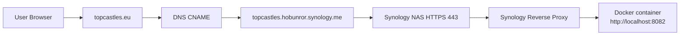

# Topcastles Domain Configuration (topcastles.eu → Synology NAS)

## Purpose

This document describes how to configure the domain `topcastles.eu` to point to a Synology-hosted application running in Docker, using Synology DDNS and Reverse Proxy.

---

## Current Architecture

- Public entrypoint:  
  https://topcastles.hobunror.synology.me:440

- Synology Reverse Proxy:
  https://topcastles.hobunror.synology.me:440 → http://localhost:8082

- Application:
  Docker container running on port `8082`

## Architecture Diagram

### Request Flow

1. User opens: https://topcastles.eu
1. DNS resolves: topcastles.eu
→ topcastles.hobunror.synology.me
→ current public IP of your home network
1. Synology receives: HTTPS request on port 443
1. Reverse proxy forwards: https://topcastles.eu → http://localhost:8082
1. Docker serves: Topcastles Angular/Node app

---

## Goal

Allow users to access the application via:

https://topcastles.eu  
(and optionally https://www.topcastles.eu)

Without exposing internal IP addresses.

---

## Key Principle

Do NOT use:
- Local IPs (e.g. 192.168.x.x)
- Hardcoded public IPs

Use Synology DDNS (`*.synology.me`) as the stable endpoint.

---

## DNS Configuration

### Preferred Option (CNAME)

If your DNS provider supports it:

#### Root domain

## SSL Certificate (Critical Step)

A correct SSL setup requires **two things**:
1. Creating a certificate
2. Explicitly assigning it to the correct hostname/service

---

### Step 1 — Create Let's Encrypt certificate

Go to:

Control Panel → Security → Certificate → Add

Select:

- "Add a new certificate"
- "Get a certificate from Let's Encrypt"

Fill in:

Domain name: topcastles.eu
Subject Alternative Name: www.topcastles.eu

---

### Step 2 — Assign the certificate (THIS IS REQUIRED)

After creation, Synology will **NOT automatically use this certificate** for your domain.

You must explicitly assign it:

Go to:

Control Panel → Security → Certificate → Settings

You will see a list of services / hostnames.

Find or set:

topcastles.eu → [Your new Let's Encrypt certificate]
www.topcastles.eu
 → [Your new Let's Encrypt certificate]

If not present:

- Ensure your reverse proxy rule exists first (see below)
- Then return to Certificate Settings

---

### Step 3 — Verify correct certificate is served

Test in browser:

https://topcastles.eu

Expected:

- No warning
- Certificate issued for: topcastles.eu
- Issuer: Let's Encrypt (e.g. E8)

---

### Common Failure Mode (What you experienced)

If you skip Step 2:

- Synology serves default certificate:
  hobunror.synology.me
- Browser error:
  ERR_CERT_COMMON_NAME_INVALID

This is NOT a DNS issue — it is a certificate assignment issue.

---

### Summary

- Certificate must exist for your domain
- Certificate must be explicitly assigned to that domain
- Reverse proxy hostname must match the certificate

Without all three, HTTPS will fail