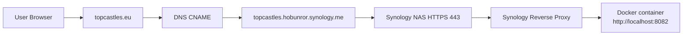

# Topcastles Domain Configuration (topcastles.eu → Synology NAS)

## Purpose

This document describes how to configure the domain `topcastles.eu` to point to a Synology-hosted application running in Docker, using Synology DDNS and Reverse Proxy.

---

## Current Architecture

- Public entrypoint:  
  https://topcastles.hobunror.synology.me:440

- Synology Reverse Proxy:
  https://topcastles.hobunror.synology.me:440 → http://localhost:8082

- Application:
  Docker container running on port `8082`

## Architecture Diagram

### Request Flow

1. User opens: https://topcastles.eu
1. DNS resolves: topcastles.eu
→ topcastles.hobunror.synology.me
→ current public IP of your home network
1. Synology receives: HTTPS request on port 443
1. Reverse proxy forwards: https://topcastles.eu → http://localhost:8082
1. Docker serves: Topcastles Angular/Node app

---

## Goal

Allow users to access the application via:

https://topcastles.eu  
(and optionally https://www.topcastles.eu)

Without exposing internal IP addresses.

---

## Key Principle

Do NOT use:
- Local IPs (e.g. 192.168.x.x)
- Hardcoded public IPs

Use Synology DDNS (`*.synology.me`) as the stable endpoint.

---

## DNS Configuration

### Preferred Option (CNAME)

If your DNS provider supports it:

#### Root domain